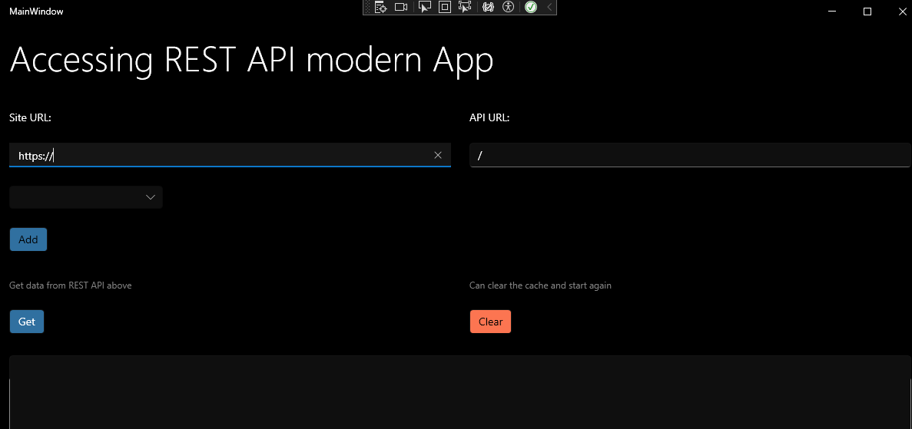

# WpfApp

## Description

This project is a testing to the authentication plugins. It is designed to get authentication from ADFS or PingFederate then can access the REST API's.

## Installation

To install this project on your local machine, follow these steps:

1. Clone the repository: `git clone https://github.com/mhmd2015/WpfApp5`
2. Run the project


## Usage
When run the app in visual studio:

To use this project, follow these steps:

1. fill the Site Url field with main domain like: **https://my-company.com** and the API URL field with relative to the service or MVC controllers like: **/api/service1/id=1**
2. its recommeneded to save these 2 fields in a local setting store to use them later by click on "Add".
3. click on **Get** button, the app will try to find if there is an authentication info in the cache, if not then will try to open a popup to login to that site.
4. in case you need to clear the authentication info in the cache and start fresh, click on "Clear" button.


# Build the App from scratch
## build new WPF
open visual studio and choose WPF Application to create a new project, its better to choose .NET 8

## Add plugins
there are 5 plugins are essential to include in the project

``` powershell
<ItemGroup>
  <PackageReference Include="MasterBlazor.WPF.Lib.Auth" Version="1.0.0" />
  <PackageReference Include="MasterBlazor.WPF.UC.LoginPage" Version="1.0.0" />
  <PackageReference Include="MasterBlazor.WPF.UC.RestForm" Version="1.0.0" />
  <PackageReference Include="Microsoft.Web.WebView2" Version="1.0.2646-prerelease" />
  <PackageReference Include="ModernWpfUI" Version="0.9.7-preview.2" />
</ItemGroup>
```
## modify App.xaml

Paste the following in the App.xaml, please change the name here "WpfApp5" with your app name
``` csharp
<Application x:Class="WpfApp5.App"
             xmlns="http://schemas.microsoft.com/winfx/2006/xaml/presentation"
             xmlns:x="http://schemas.microsoft.com/winfx/2006/xaml"
             xmlns:local="clr-namespace:WpfApp5"
             StartupUri="MainWindow.xaml"
             xmlns:ui="http://schemas.modernwpf.com/2019">
    <Application.Resources>
            <ResourceDictionary>
                <ResourceDictionary.MergedDictionaries>
                    <ui:ThemeResources />
                    <ui:XamlControlsResources />
                    <!-- Other merged dictionaries here -->
                </ResourceDictionary.MergedDictionaries>
                <!-- Other app resources here -->
            </ResourceDictionary>
        </Application.Resources>
</Application>
```
## modify the MainWindow.xaml

Add the namespaces to the Window attributes 
```html
xmlns:rf="clr-namespace:MasterBlazor.WPF.UC.RestForm;assembly=MasterBlazor.WPF.UC.RestForm"
xmlns:ui="http://schemas.modernwpf.com/2019"
ui:WindowHelper.UseModernWindowStyle="True"
```

then add the content to the page:
``` html
    <Grid>
    <Grid.RowDefinitions>
        <RowDefinition Height="100" />
        <RowDefinition Height="220" />
        <RowDefinition Height="100" />
        <RowDefinition Height="*" />
        
    </Grid.RowDefinitions>

    <ui:SimpleStackPanel Grid.Row="0" Margin="12" Spacing="24">
        
        <TextBlock Text="Accessing REST API modern App" Style="{StaticResource HeaderTextBlockStyle}" />
    </ui:SimpleStackPanel>
    <Grid Grid.Row="1">
        <Grid.ColumnDefinitions>
            <ColumnDefinition Width="*"/>
            <ColumnDefinition Width="*"/>
        </Grid.ColumnDefinitions>
        <ui:SimpleStackPanel Grid.Column="0" Margin="12" Spacing="24">
            <Label Content="Site URL:" HorizontalAlignment="Left"  />
            <TextBox x:Name="txtUrl" Text="https://" Style="{StaticResource DataGridTextBoxStyle}" />

            <rf:ComboSettings1 x:Name="comboSettings1" ComboBoxItemSelected="comboSettings1_ComboBoxItemSelected" />
            <Button Content="Add" Click="AddSettingItem_Click" Style="{StaticResource AccentButtonStyle}" Background="#3070A0" />
        </ui:SimpleStackPanel>
        <ui:SimpleStackPanel Grid.Column="1" Margin="12" Spacing="24">
            <Label Content="API URL:" HorizontalAlignment="Left"  />
            <TextBox x:Name="txtAPI" Text="/" />
        </ui:SimpleStackPanel>
    </Grid>
    

    <Grid Grid.Row="2" >
        <Grid.ColumnDefinitions>
            <ColumnDefinition Width="*"/>
            <ColumnDefinition Width="*"/>
        </Grid.ColumnDefinitions>
        <ui:SimpleStackPanel Grid.Column="0" Margin="12" Spacing="24" >
            <Label Content="Get data from REST API above" HorizontalAlignment="Left" FontSize="12" Foreground="Gray" />
            <Button x:Name="btnGet" Content="Get" Click="btnGet_Click"  HorizontalAlignment="Left" Background="#3070A0" Style="{StaticResource DefaultButtonStyle}" />
            


        </ui:SimpleStackPanel>
        <ui:SimpleStackPanel Grid.Column="1" Margin="12" Spacing="24">
            <Label Content="Can clear the cache and start again" HorizontalAlignment="Left" FontSize="12" Foreground="Gray" />
            <Button x:Name="btnClear" Content="Clear" Click="btnClear_Click" HorizontalAlignment="Left" Style="{StaticResource AccentButtonStyle}"  />
            
        </ui:SimpleStackPanel>
                
    </Grid>

    <ui:SimpleStackPanel Grid.Row="3" Margin="12" Spacing="24">
        <!--<TextBox x:Name="txtResult0" Text="" Width="800" /> -->
        <TextBox x:Name="txtResult" TextWrapping="Wrap" AcceptsReturn="True" MinHeight="400" MaxHeight="1000" VerticalScrollBarVisibility="Auto" >
        </TextBox>
    </ui:SimpleStackPanel>


</Grid>
```

## modify the MainWindow.xaml.cs

in the using part add the following:
```csharp
using MasterBlazor.WPF.Lib.Auth;
using MasterBlazor.WPF.UC.LoginPage;
using MasterBlazor.WPF.UC.RestForm;
```

replace the class MainWindow with the following:
```csharp
public partial class MainWindow : Window
{
    LoginWindow loginWindow;
    RestManager restManager;
    AuthManager authManager;
    public MainWindow()
    {
        InitializeComponent();
    }
    public async Task Login(string url)
    {
        if (loginWindow == null)
        {
            loginWindow = new LoginWindow(url);
            loginWindow.LoginCompleted += LoginWindow_LoginCompleted;
        }

        bool? result = loginWindow.ShowDialog();


    }

    private void LoginWindow_LoginCompleted(object? sender, string e)
    {
        loginWindow.Close();
        GetData();
    }

    private async void btnGet_Click(object sender, RoutedEventArgs e)
    {
        if (txtUrl.Text != "" && txtUrl.Text != "https://")
        {
            await GetData();
        }
    }

    private async void btnClear_Click(object sender, RoutedEventArgs e)
    {
        if (txtUrl.Text != "" && txtUrl.Text != "https://")
        {
            if (authManager == null)
                authManager = new AuthManager(txtUrl.Text);
            authManager.Reset();

            if (restManager == null)
                restManager = new RestManager(null, txtUrl.Text);
            restManager.Reset();
        }
    }

    private async Task GetData()
    {
        if (authManager == null)
            authManager = new AuthManager(txtUrl.Text);

        var auth = authManager.Load();

        if (auth == null || auth.Count == 0)
        {
            if (loginWindow == null)
                await Login(txtUrl.Text);
        }
        else if (txtAPI.Text != "" && txtAPI.Text != "/")
        {

            if (restManager == null)
                restManager = new RestManager(auth, txtUrl.Text);
            txtResult.Text = await restManager.Get(txtAPI.Text);
        }
    }
    private void AddSettingItem_Click(object sender, RoutedEventArgs e)
    {
        comboSettings1.AddItem(txtUrl.Text, txtAPI.Text);
    }

    private void comboSettings1_ComboBoxItemSelected(object sender, ComboBoxItemData e)
    {
        txtUrl.Text = e.SiteUrl;
        txtAPI.Text = e.ApiUrl;

        if (restManager != null)
        {
            restManager.Dispose();
            restManager = null;
            GetData();
        }
    }
}
```


## License

This project is licensed under the MIT.

## Contact

If you have any questions, feel free to reach out to us at mhmd2015.
